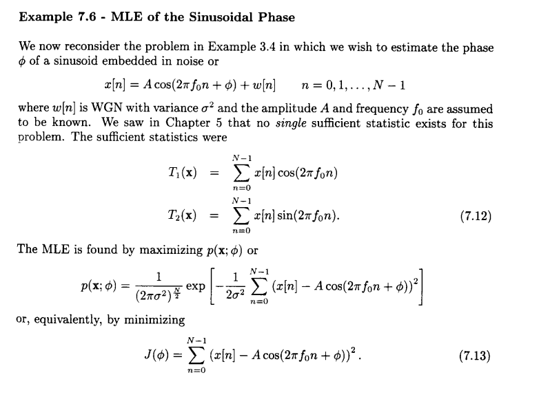
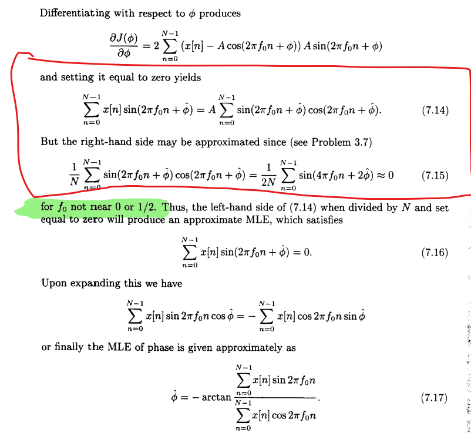
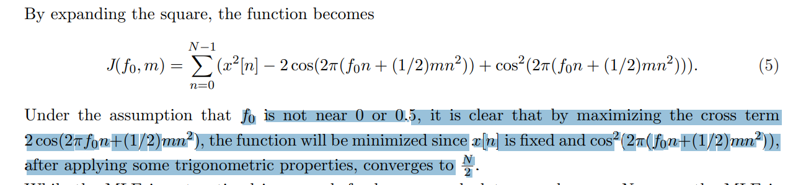
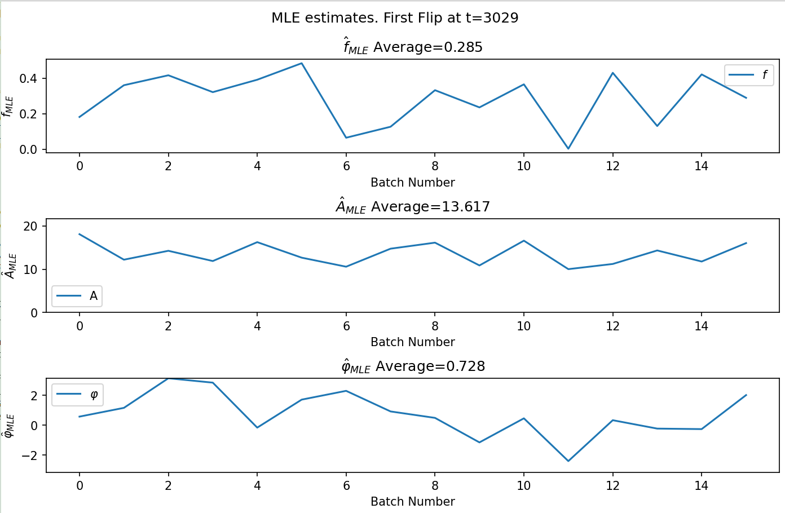
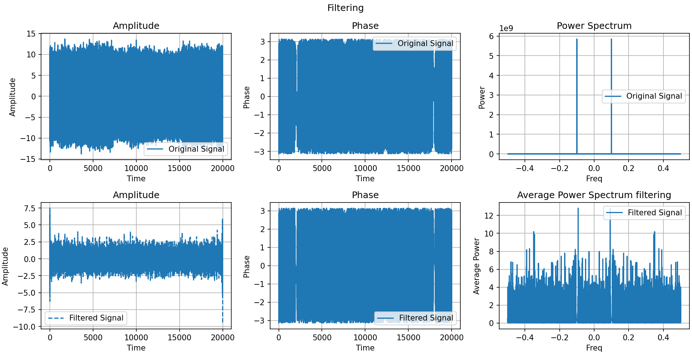
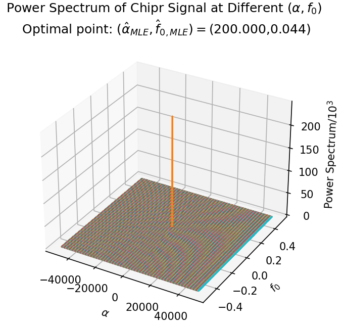
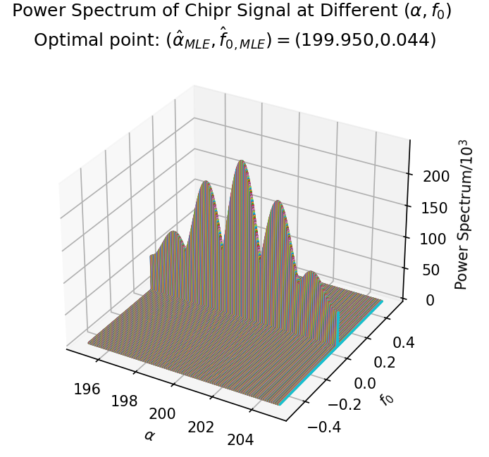
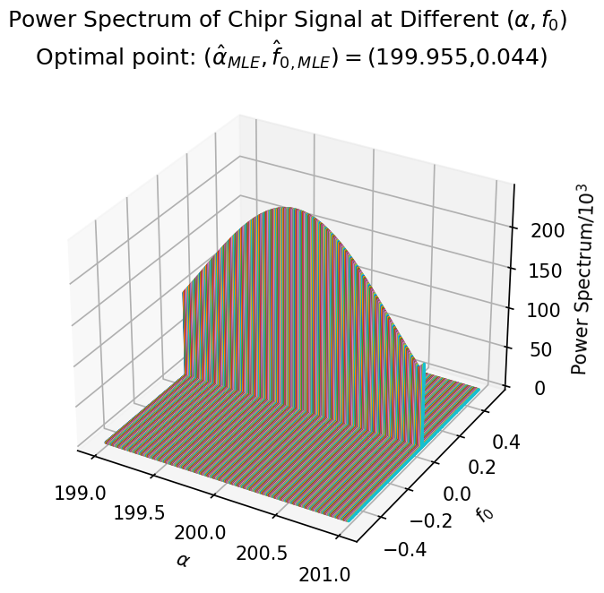

## Problem 1

$y(t)=x(t)+w(t)$

$w(t)\sim \mathcal{N}(0,\sigma^2)$
$$
x(t)=\sum_{k=1}^N a_k \cos \left(2 \pi f_k t+\varphi_k\right):=\mu[t;\theta]
$$
$\vec{\theta}:=[a_{1:N};f_{1:N};\varphi_{1:N}]^\top$

$y(t)\sim \mathcal{N}\left(\sum_{k=1}^N a_k \cos \left(2 \pi f_k t+\varphi_k\right), \sigma^2\right):=\mathcal{N}(\mu_\theta(t)\ ,\  \sigma^2)$

Suppose that we collect $n$ data samples from of signal $y(t)$. 

$\vec{y}\sim \mathcal{N}(\vec{\mu_\theta}, \sigma^2 \mathbb{I}_{N})$  where $\vec{\mu_\theta}=\sum_{t=0}^{n-1} \mu_\theta(t)\mathbf{e}_t$

Define
$$
\langle y_1,y_2 \rangle = \sum_{t=1}^N~y_1[t]\ y_2[t]\\
\norm{\vec{y}}_2^2:=\langle \vec{y}, \vec{y} \rangle
$$

$$
\ln p_{\mathsf{y}}(\vec{y};\vec{\theta})=-\frac{N}{2} \ln 2\pi \sigma^2-\frac{1}{2\sigma^2} \norm{\vec{y}-\vec{\mu_\theta}}_2^2
$$

$$
\frac{\partial }{\partial {\theta_i}}\ln p_{\mathsf{y}}(\vec{y};\vec{\theta})
=\left\langle
\frac{\vec{y}-\vec{\mu_\theta}}{\sigma^2}, \frac{\partial }{\partial {\theta_i}}\vec{\mu}_\theta
\right\rangle
=
\sum_{t=0}^{N-1}
\frac{\vec{y}[t]-\vec{\mu}[t;\theta]}{\sigma^2} \frac{\partial }{\partial {\theta_i}}\vec{\mu}[t;\theta]
$$
where the derivative of a vector is taken pointwise.

By setting the derivatives to zero, we obtain a series of non-linear equations:

$$
\sum_{t=0}^{n-1}\left(y[t]-\sum_{k=1}^{N}a_k\cos(2\pi f_k t+\varphi_k)\right)\cdot \cos(2\pi f_i t+\varphi_i)=0
\\
\sum_{t=0}^{n-1}\left(y[t]-\sum_{k=1}^{N}a_k\cos(2\pi f_k t+\varphi_k)\right)\cdot a_it\cdot \sin(2\pi f_i t+\varphi_i)=0
\\
\sum_{t=0}^{n-1}\left(y[t]-\sum_{k=1}^{N}a_k\cos(2\pi f_k t+\varphi_k)\right)\cdot a_i\sin(2\pi f_i t+\varphi_i)=0
$$

Denote by

$\alpha_k:=a_k\cos \varphi_k$ and $\beta_k=-a_k\sin \varphi_k$

Then
$$
\arg\min_\theta=\arg\min_\theta
\sum_{t=0}^{n-1}\left(y[t]-\sum_{k=1}^N \alpha_k \cos(2\pi f_k t)+\beta_k \sin (2\pi f_k t)\right)^2
$$
Setting the derivative of $f_i$ to zero, we get
$$
\sum_{t=0}^{n-1}\left(y[t]-\sum_{k=1}^N \alpha_k \cos(2\pi f_k t)+\beta_k \sin (2\pi f_k t)\right)\cdot \left(-t\alpha_i\sin (2\pi f_i)+t\beta_i \cos(2\pi f_i t)\right)
$$

​	

## Problem 2

Formulation:
$$
\begin{equation}
\begin{aligned}
x(t)=&a(t) \cos (2 \pi f t+\varphi)\\
y(t)=&x(t)+w(t)
\end{aligned}
\end{equation}
$$
In vector form,
$$
\begin{align}
\vec{y}=&\underbrace{\operatorname{diag}[\cos(2\pi f\cdot 0+\varphi), \ldots, \cos(2\pi f\cdot (N-1)+\varphi)]}_{:=B(f,\varphi)}\cdot \vec{a}+\vec{w}
:=
B(f,\varphi) \vec{a}+\vec{w}
\end{align}
$$
where $w\overset{\text{i.i.d.}}{\sim}\mathcal{N}(0,\sigma^2)$ and $B(\cdot,\cdot):\R^2\to \R^{N\times N}$ is a non-linear, matrix-valued function of the parameters $f, \varphi$. Though the ML problme under this model is non-linear in its essensce, the fact that the non-linear parameters and linear parameters are decoupled implies that it can solved in two steps:
$$
\begin{equation}
\begin{aligned}
\hat{f}_{\text{MLE}}, \hat{\varphi}_{\text{MLE}}, \hat{\alpha}_{\text{MLE}}
=&
\underset{f,\varphi,\alpha}{\operatorname{argmax}}\ln p(x;f,\varphi,\alpha)
\\=&
\underset{f,\varphi,\alpha}{\operatorname{argmin}}\norm{\vec{x}-B(f,\varphi)\vec{a}}_2^2
\\=&
\underset{f,\varphi}{\operatorname{argmin}}
\underbrace{\left(
\underset{\alpha}{\operatorname{argmin}}
a^\top B^\top Ba-2\langle B^\top x, a \rangle
\right)}_{\text{Standard Least-Square Estimate Problem}}
\end{aligned}
\end{equation}
$$
We have omitted the vector signs over $\vec{a}$ and $\vec{x}$ and the variables of function $B(\cdot,\cdot)$ in the last display for brevity. 

Conditioned on the non-linear varibles $f$ and $\varphi$, we can obtain the optimal value of $\alpha$ by computing the derivative of the objective function in the inner brackets:
$$
\hat{\alpha}_{\text{opt}}(f,\varphi)=\left(B(f,\varphi)^\top B(f,\varphi)\right)^{-1}B(f,\varphi)^\top x
$$
Taking $\alpha=\hat{\alpha}_{\text{opt}}(f,\varphi)$,  with some simple algebraic computations we further conclude
$$
\begin{equation}
\begin{aligned}
\hat{f}_{\text{MLE}}, \hat{\varphi}_{\text{MLE}}
=&
\underset{f,\varphi}{\operatorname{argmin}}
\left(
a^\top B(f,\varphi)^\top B(f,\varphi)a-2\langle B(f,\varphi)^\top x, a \rangle
\right)
\bigg|_{a=\hat{\alpha}_{\text{opt}}(f,\varphi)}
\\=&
\underset{f,\varphi}{\operatorname{argmax}}
x^\top B(B^\top B)^{-1}B^\top x
\\=&
\underset{f,\varphi}{\operatorname{argmax}}
\norm{B^\top x}_{(B^\top B)^{-1}}
\end{aligned}
\end{equation}
$$
In general, finding the MLE estimates of $f$ and $\varphi$ involves solving a non-linear non-convex optimization problem. We can adopt gradient ascent algorithms such as Newton-Raphson iteration to approxiamately find $\hat{f}_{\text{MLE}}, \hat{\varphi}_{\text{MLE}}$:
$$
\theta_{k+1}=\theta_{k}+\nabla_{\theta}L(\theta_k)^\top (\theta-\theta_k)
$$
where $\theta=[f,\varphi]^\top$. 

​	

Then the MLE estimator of $\alpha$ can be calculated as
$$
\hat{\alpha}_{\text{MLE}}
=\hat{\alpha}_{\text{opt}}(\hat{f}_{\text{MLE}}, \hat{\varphi}_{\text{MLE}})
=\left(B(\hat{f}_{\text{MLE}}, \hat{\varphi}_{\text{MLE}})^\top B(\hat{f}_{\text{MLE}}, \hat{\varphi}_{\text{MLE}})\right)^{-1}B(\hat{f}_{\text{MLE}}, \hat{\varphi}_{\text{MLE}})^\top x
$$
which is the MLE estimate of the envelope $a[t]$. 

Wait: in our problem… f and varphi does not have a fixed solution…$\underset{f,\varphi}{\operatorname{argmax}}
x^\top B(B^\top B)^{-1}B^\top x$ deteriorates to $-\norm{x}_2^2$…$\hat{\alpha}_{\text{opt}}(f,\varphi)[t]=\frac{x[t]}{\cos(2\pi f+\varphi)}$. Which means MLE fails…?

Reference: page 256 of Stephen Kay Estimtation Theory (Non linear least square)

## Problem 3

#### Triogonometry identities

When $f\in (\epsilon, \pi-\epsilon)$, $\epsilon \in (0,\frac{\pi}{2})$, 
$$
\begin{equation}
\begin{aligned}
\sum_{n=0}^{N-1}\sin(nf)=&\Im \sum_{n=0}^{N-1}e^{jnf}=\Im \frac{e^{jNf}-1}{e^{jf}-1}
=\Im \left(e^{j\frac{N-1}{2}}\cdot \frac{e^{j\frac{N}{2}f}-e^{-j\frac{N}{2}f}}{e^{j\frac{f}{2}}-e^{-j\frac{f}{2}}}\right)
\\=&\Im \left(e^{j\frac{N-1}{2}f}\frac{\sin(\frac{N}{2}f)}{\sin(\frac{1}{2}f)}\right)
\\=&\frac{\sin(\frac{N}{2}f)}{\sin(\frac{1}{2}f)}\cdot \sin\left(\frac{N-1}{2} f\right)
\end{aligned}
\end{equation}
$$
Similarly, 
$$
\begin{equation}
\begin{aligned}
\sum_{n=0}^{N-1}\cos(nf)=&\Re \sum_{n=0}^{N-1}e^{jnf}
\\=&\frac{\sin(\frac{N}{2}f)}{\sin(\frac{1}{2}f)}\cdot \cos\left(\frac{N-1}{2} f\right)
\end{aligned}
\end{equation}
$$
Using the identity $\sin(a+b)=\sin(a)\cos(b)+\sin b \cos a$ and $\cos(a+b)=\cos a \cos b - \sin a \sin b$, we further obtain
$$
\begin{equation}
\begin{aligned}
\sum_{n=0}^{N-1}\sin(nf+\theta)
=&\frac{\sin(\frac{N}{2}f)}{\sin(\frac{1}{2}f)}\cdot \sin\left(\frac{N-1}{2} f+\theta\right)\\
\sum_{n=0}^{N-1}\cos(nf+\theta)
=&\frac{\sin(\frac{N}{2}f)}{\sin(\frac{1}{2}f)}\cdot \cos\left(\frac{N-1}{2} f+\theta\right)\\
\end{aligned}
\end{equation}
$$
Proceeding with $\cos^2(x)=\frac{1+\cos(2x)}{2}$, $\sin^2 (x)=\frac{1-\cos(2x)}{2}$  and $\sin(x)\cos(x)=\frac{\sin(2x)}{2}$ we conclude
$$
\begin{equation}
\begin{aligned}
\sum_{n=0}^{N-1}\sin^2(nf)
=&
\frac{N}{2}-\frac{\sin(Nf)}{2\sin(f)}\cdot \cos\left((N-1)f\right)\\
\sum_{n=0}^{N-1}\cos^2(nf)
=&
\frac{N}{2}+\frac{\sin(Nf)}{2\sin(f)}\cdot \cos\left((N-1)f\right)\\
\sum_{n=0}^{N-1}\cos(nf)\sin(nf)
=&
\frac{\sin(Nf)}{2\sin(f)}\cdot \sin\left((N-1)f\right)\\
\end{aligned}
\end{equation}
$$

#### Special Case with Constant Envelope

Suppose that $A,f,\varphi$ are fixed yet unknown parameters and there exists some  $\epsilon \in (0,\frac{\pi}{2})$ such that  $f\in (\epsilon, \frac{1}{2}-\epsilon)$, we want to obtain the MLE estimator of the three parameters from observations corrputed by AWGN:
$$
y[t]=A\cos(2\pi f t+\varphi)+w[t]
$$
That the signal possess Gaussian pdf implies the estimator problem is equivalent to the following forms:
$$
\begin{equation}
\begin{aligned}
\underset{A,f,\varphi}{\operatorname{minimize}} \ln p(y;A,f,\varphi)
=&
\underset{A,f,\varphi}{\operatorname{minimize}} \sum_{n=0}^{N-1}\left[x[n]-A\cos(2\pi f n + \varphi)\right]^2
\\=&
\underset{A,f,\varphi}{\operatorname{minimize}} \sum_{n=0}^{N-1}\left[x[n]-
(\underbrace{A\cos \varphi}_{:=\alpha_{A,\varphi}}\cos(2\pi f n)
+(\underbrace{-A\sin \varphi}_{:=\beta_{A,\varphi}}) \sin(2\pi f n))
\right]^2
\\=&
\underset{A,f,\varphi}{\operatorname{minimize}} \sum_{n=0}^{N-1}\left[x[n]-(\alpha_{A,\varphi} \cos(2\pi f n)+\beta_{A,\varphi} \sin(2\pi f n)\right]^2
\\=&
\underset{A,f,\varphi}{\operatorname{minimize}}
\norm{\vec{x}-
\underbrace{\begin{bmatrix}
\cos(2\pi f\cdot 0) & \sin(2\pi f\cdot 0)\\
\cos(2\pi f\cdot 1) & \sin(2\pi f\cdot 1)\\
\ldots              & \ldots             \\
\cos(2\pi f\cdot (N-1)) & \sin(2\pi f\cdot (N-1))
\end{bmatrix}}_{:=H_{f}}
\begin{bmatrix}
\alpha_{A,\varphi} \\
\beta_{A,\varphi}
\end{bmatrix}
}_2^2
\\=&
\underset{f}{\operatorname{minimize}}
\left(
\underset{A,\varphi}{\operatorname{minimize}} 
\norm{\vec{x}-H_f \begin{bmatrix}\alpha_{A,\varphi} \\\beta_{A,\varphi}\end{bmatrix}}_2^2
\right)
\end{aligned}
\end{equation}
$$
Given $f$, the optimal values of $\alpha$ and $\beta$ can be immediately obtained via an unconstrained least-square optimization:
$$
\begin{bmatrix}\alpha_{A,\varphi} \\\beta_{A,\varphi}\end{bmatrix}(f)
=(H_f^\top H_f)^{-1}H_f^\top x
$$
Then we can recover the corresponding $A$ and $\varphi$ by 
$$
\begin{bmatrix}A\\\varphi\end{bmatrix}=
\begin{bmatrix}\sqrt{\alpha^2+\beta^2}\\-\arctan^{-1}\left(\frac{\beta}{\alpha}\right)\end{bmatrix}
$$
Taking the optimal values of $A$ and $\varphi$ back to the original problem, we discover that
$$
\begin{equation}
\begin{aligned}
&\underset{A,f,\varphi}{\operatorname{minimize}} \ln p(y;A,f,\varphi)
\\=&
\underset{f}{\operatorname{minimize}}
\norm{\vec{x}-H_f
(H_f^\top H_f)^{-1}H_f^\top x
}_2^2
\\=&
\underset{f}{\operatorname{minimize}}
\ x^\top x - x^\top H_f(H_f^\top H_f)^{-1}H_f^\top x
-x^\top H_f(H_f^\top H_f)^{-1}H_f^\top x
+x^\top H_f(H_f^\top H_f)^{-1}H^\top x
\\=&
\underset{f}{\operatorname{maximize}}
\ x^\top H_f(H_f^\top H_f)^{-1}H_f^\top x
\end{aligned}
\end{equation}
$$
Now we will simplify the optimiazation objective under the setting of
$$
H_f:=\begin{bmatrix}
\cos(2\pi f\cdot 0) & \sin(2\pi f\cdot 0)\\
\cos(2\pi f\cdot 1) & \sin(2\pi f\cdot 1)\\
\ldots              & \ldots             \\
\cos(2\pi f\cdot (N-1)) & \sin(2\pi f\cdot (N-1))
\end{bmatrix}
:=[c & s]
$$
Proceeding, 
$$
H_f^\top H_f =
\begin{bmatrix}
c^\top c & c^\top s\\
s^\top c & s^\top s
\end{bmatrix}
$$
Taking the definitinon of $c$ and $s$ back to the entries in the expression above, we observe that
$$
\begin{equation}
\begin{aligned}
c^\top c=&\sum_{n=0}^{N-1}\cos^2(2\pi f n)=\frac{N}{2}+\frac{\sin(2\pi fN)}{2\sin(2\pi f)}\cdot \cos\left(2\pi (N-1)f\right)\\
s^\top s=&\sum_{n=0}^{N-1}\sin^2(2\pi f n)=\frac{N}{2}-\frac{\sin(Nf)}{2\sin(f)}\cdot \cos\left(2\pi (N-1)f\right)\\
c^\top s=&\sum_{n=0}^{N-1}\cos(2\pi f n)\sin(2\pi f n)=\frac{1}{2}\frac{\sin(2\pi fN)}{\sin (2 \pi f)} \sin(2\pi (N-1) f)
\end{aligned}
\end{equation}
$$
Under the assumption that $f\in (\epsilon,\frac{1}{2}-\epsilon), $ we discover that as $N$ becomes large, these entries becomes asymptotically independent of the frequency $f$:

By the fact that
$$
\abs{\frac{1}{N}c^\top c-\frac{1}{2}}  \leq \frac{1}{2N\sin (2\pi \epsilon)}\cdot 1 \to 0\quad, N\to \infty
$$
we conclude
$$
\lim_{N\to \infty} c^\top c= \frac{N}{2}
$$
Similarly, 
$$
\lim_{N\to \infty} s^\top s = \frac{N}{2}
$$
and the two components $c$ and $s$ are asympototically orthogonal: 
$$
\lim_{N\to \infty} c^\top s = 0
$$
These observations imply that when $N\to \infty$ and $f\in (\epsilon,\pi-\epsilon)$,
$$
\lim_{N\to \infty}\norm{H_f^\top H-
\begin{bmatrix}
\frac{N}{2} & 0\\
0         	& \frac{N}{2}
\end{bmatrix}
}_{\text{FB}}=0
$$
which indicates our optimization problem becomes
$$
\begin{equation}
\begin{aligned}
\underset{A,f,\varphi}{\operatorname{minimize}} \ln p(y;A,f,\varphi)
\overset{N>>1}{\approx} &
\underset{f}{\operatorname{maximize}}\ x^\top H_f \cdot \frac{2}{N} \mathbb{I}\cdot H_f^\top x
\\=&\underset{f}{\operatorname{maximize}}\ 
\frac{2}{N}\left((c^\top x)^2+(s^\top x)^2\right)
\\=&\underset{f}{\operatorname{maximize}}\
\frac{2}{N}
\left[
\left(\sum_{n=0}^{N-1}x[n]\cos(2\pi f n)\right)^2
+
\left(\sum_{n=0}^{N-1}x[n]\sin(2\pi f n)\right)^2
\right]
\\=&\underset{f}{\operatorname{maximize}}\ 
\frac{2}{N}\left((c^\top x)^2+(s^\top x)^2\right)
\\=&\underset{f}{\operatorname{maximize}}\
\frac{2}{N}
\left[
\Re^2\left(\sum_{n=0}^{N-1}x[n]e^{j2\pi f n}\right)
+
\Im^2\left(\sum_{n=0}^{N-1}x[n]e^{j2\pi f n}\right)
\right]
\\=&\underset{f}{\operatorname{maximize}}\
2\cdot 
\underbrace{\frac{1}{N}\abs{\sum_{n=0}^{N-1}x[n]e^{j2\pi f n}}^2
}_{\text{Average Power Spectrum of $x$ at $f$}}
\end{aligned}
\end{equation}
$$
The derivations above shows that we can obtain the MLE estimate of the frequency $f$ with Fast Fourier Transform, when $N$ is sufficiently large: 
$$
\hat{f}_{\text{MLE}}=\underset{f}{\operatorname{argmax}}\ \frac{1}{N} \abs{\operatorname{FFT}[x]}^2(f)
$$
where the maximization step can be implemented by a grid search. 

Upon obtaining $\hat{f}_{\text{MLE}}$, under the assumption that $N>>1$ and $f\in (\epsilon,\frac{1}{2}-\epsilon)$, we can obtain the MLEs for $\alpha$ and $\beta$​, 
$$
\begin{equation}
\begin{aligned}
\begin{bmatrix}
\hat{\alpha}_{\text{MLE}} \\\hat{\beta}_{{A,\varphi}}
\end{bmatrix}
=&
\begin{bmatrix}
\hat{\alpha}_{A,\varphi} \\\hat{\beta}_{A,\varphi}
\end{bmatrix}(\hat{f}_{\text{MLE}})
=\left( H^\top H\right)^{-1}H_{\hat{f}_{\text{MLE}}}^\top x
\approx
\frac{2}{N} 
\begin{bmatrix}
c^\top x\\ s^\top x
\end{bmatrix}
\\=&
\frac{2}{N} 
\begin{bmatrix}
\Re \left(\sum_{n=0}^{N-1}x[n]e^{j2\pi n\hat{f}_{\text{MLE}}}\right)
\\
\Im \left(\sum_{n=0}^{N-1}x[n]e^{j2\pi n\hat{f}_{\text{MLE}}}\right)
\end{bmatrix}
\\=&
\frac{2}{N} 
\begin{bmatrix}
\Re \left(\operatorname{FFT}[x](\hat{f}_{\text{MLE}})\right)
\\
\Im \left(\operatorname{FFT}[x](\hat{f}_{\text{MLE}})\right)
\end{bmatrix}
\end{aligned}
\end{equation}
$$
Applying the inverse of the non-linear transfomr between $\alpha,\beta$ and $A,\varphi$, we conclude:
$$
\begin{bmatrix}\hat{A}_{\text{MLE}}\\\hat{\varphi}_{\text{MLE}}\end{bmatrix}
=
\begin{bmatrix}\sqrt{\hat{\alpha}_{\text{MLE}} ^2+\hat{\beta}_{{A,\varphi}}^2}\\-\arctan^{-1}\left(\frac{\hat{\beta}_{{A,\varphi}}}{\hat{\alpha}_{\text{MLE}}}\right)\end{bmatrix}
=
\begin{bmatrix}
\frac{2}{N} \abs{\operatorname{FFT}[x](\hat{f}_{\text{MLE}})}^2 \\
-\operatorname{Phase}\left(\operatorname{FFT}[x](\hat{f}_{\text{MLE}})\right)
\end{bmatrix}
$$

##### Algorithm Description

Summarizing our findings into an algorithm, we can approximately find the MLE estimates of $A,\varphi,$ and $f$ by the following steps: 

* Use a grid search to find the peak frequency $f^*$of the power spectrum of $x[n]$​. 

* Record the corresponding maximum average power and the phase

  $P^*:=\frac{1}{N}\abs{\operatorname{FFT}[x]}^2(f^*):=\max_{f}\frac{1}{N}\abs{\operatorname{FFT}[x]}^2(f)$​ 

  $\varphi^*:=\operatorname{Phase}\left(\operatorname{FFT}[x](f^*)\right)$

* Return the appr oximate MLE estimators:
  $$
  \begin{bmatrix}
  \hat{A}_{\text{MLE}} \\\hat{\varphi}_{{A,\varphi}} \\ \hat{f}_{\text{MLE}}
  \end{bmatrix}
  \leftarrow
  \begin{bmatrix}
  2P^*\\ -\varphi^* \\ f^*
  \end{bmatrix}
  $$
  We want to stress that this algorithms admits low approximation error only when $N$​ is sufficiently large and the true value of $f$​ is not near to integers and half integers. Due to periodicality of sinusoidal waves, our output $f$ is restricted in $(0,\frac{1}{2})$. 

initial flip is at time=3029

## Problem 4

#### MLE estimator

$$
\begin{equation}
\begin{aligned}
\arg\max_{\theta}\ \ln p_{\mathsf{y}}(\vec{y};\vec{\theta})
=&
\arg\max_{\theta}\ \left(-\frac{N}{2} \ln 2\pi \sigma^2-\frac{1}{2\sigma^2} \norm{\vec{y}-\vec{\mu_\theta}}_2^2\right)
\\=&
\arg\min_{\theta} \norm{\vec{y}-\vec{\mu_\theta}}_2^2
\end{aligned}
\end{equation}
$$

Since $\mu[t;\theta]=\sum_{k=1}^N a_k \cos \left(2 \pi f_k t+\varphi_k\right)$

Taking the derivative, we obtain
$$
\left\langle
\vec{y}-\vec{\mu_\theta}\ , \ \frac{\partial}{\partial \theta_i}\vec{\mu}_\theta \right\rangle
\bigg|_{\theta=\theta_{\text{MLE}}}=0
$$
which is equivalent to
$$
\sum_{t=0}^{n-1}
\left(y[t]-\mu[t;\theta]\right)
\frac{\partial}{\partial \theta_i}\mu[t;\theta]=0 
$$

#### Cramer-Rao lower bound

$$
{C}_{\widehat\theta}-I_{\theta}^{-1}\geq 0
$$

where 
$$
I_\theta = \mathbb{E}_{y\sim p_{\mathsf{y}(\cdot;\vec{\theta})}}\left[\nabla_{\theta}\ln p_{\mathsf{y}}(\cdot;\theta)\ \nabla_{\theta}^\top\ln p_{\mathsf{y}}(\cdot;\theta)\right]
$$
Each entry
$$
\begin{equation}
\begin{aligned}\\
[I_\theta]_{i,j}=&
\mathbb{E}_{y\sim p_{\mathsf{y}(\cdot;\vec{\theta})}}\left[\frac{\partial }{\partial {\theta_i}}\ln p_{\mathsf{y}}(\vec{y};\vec{\theta})
\frac{\partial }{\partial {\theta_j}}\ln p_{\mathsf{y}}(\vec{y};\vec{\theta})\right]
\\=&
\mathbb{E}\left[\left\langle
\frac{\vec{y}-\vec{\mu_\theta}}{\sigma^2}, \frac{\partial }{\partial {\theta_i}}\vec{\mu}_\theta
\right\rangle
\left\langle
\frac{\vec{y}-\vec{\mu_\theta}}{\sigma^2}, \frac{\partial }{\partial {\theta_j}}\vec{\mu}_\theta
\right\rangle
\right]
\\=&
\frac{\partial }{\partial {\theta_i}}\vec{\mu}_\theta^\top
\ \mathbb{E}_{\vec{y}\sim \mathcal{N}(\mu_\theta,\sigma^2)}
\left[
\left(\frac{\vec{y}-\vec{\mu_\theta}}{\sigma^2}\right)
\left(\frac{\vec{y}-\vec{\mu_\theta}}{\sigma^2}\right)^\top
\right]
\frac{\partial }{\partial {\theta_j}}\vec{\mu}_\theta
\\=&
\frac{\partial }{\partial {\theta_i}}\vec{\mu}_\theta^\top
\  \mathbb{I}_{n} \ 
\frac{\partial }{\partial {\theta_j}}\vec{\mu}_\theta
\\=&
\sum_{t=0}^{n-1}
\frac{\partial }{\partial {\theta_i}}{\mu}[t;\theta]
\frac{\partial }{\partial {\theta_j}}{\mu}[t;\theta]
\end{aligned}
\end{equation}
$$
where
$$
\frac{\partial }{\partial {a_i}}{\mu}[t;\theta]=
\frac{\partial }{\partial {a_i}}
\sum_{k=1}^N a_k \cos \left(2 \pi f_k t+\varphi_k\right)
=\cos \left(2 \pi f_k t+\varphi_k\right)
$$

$$
\frac{\partial }{\partial {f_i}}{\mu}[t;\theta]=
\frac{\partial }{\partial {f_i}}\sum_{k=1}^N a_k \cos \left(2 \pi f_k t+\varphi_k\right)
=-2\pi t \ a_k\ \sin \left(2 \pi f_k t+\varphi_k\right)
$$

$$
\frac{\partial }{\partial {\varphi_i}}{\mu}[t;\theta]=
\frac{\partial }{\partial {\varphi_i}}\sum_{k=1}^N a_k \cos \left(2 \pi f_k t+\varphi_k\right)
=-a_k\ \sin \left(2 \pi f_k t+\varphi_k\right)
$$

We obtain
$$
\text{var}[\widehat{a}_{i}]\geq [C_{\widehat{\theta}}]_{a_i,a_i} \geq \left[I^{-1}\right]_{a_i,a_i}\\
\text{var}[\widehat{f}_{i}]\geq [C_{\widehat{\theta}}]_{f_i,f_i} \geq \left[I^{-1}\right]_{f_i,f_i}\\
\text{var}[\widehat{\varphi}_{i}]\geq [C_{\widehat{\theta}}]_{\varphi_i,\varphi_i} \geq \left[I^{-1}\right]_{\varphi_i,\varphi_i}\\
$$

Problem 4:
$$
y(t)\overset{\text{iid}}{\sim }\mathcal{N}(A\cos(2\pi(f_0t+\frac{\alpha}{2}t^2), \sigma^2)
$$
Let $\theta=[f,\alpha]^\top$. 

Likelihood function
$$
p_{\mathsf{y}}(y;\theta)=\frac{1}{(2\pi \sigma^2)^{N/2}}e^{-\frac{1}{2\sigma^2}\sum_{t=0}^{N-1}(y[t]-A\cos(2\pi(f_0t+\frac{\alpha}{2}t^2)^2)}
$$
[Real-value function analysis]

To solve the MLE estimator, it suffices to
$$
\begin{equation}
\begin{aligned}
&\underset{\theta}{\text{minimize}}\ 
\frac{1}{N}\sum_{t=0}^{N-1}\left(y[t]-A\cos(2\pi f_0t+\pi\alpha t^2)\right)^2
\\=&
\underset{\theta}{\text{minimize}}\ 
\frac{1}{N}\sum_{t=0}^{N-1}y^2[t]+A^2\cos^2(2\pi f_0t+\pi\alpha t^2)-2A\cos(2\pi f_0 t+\pi \alpha t^2) y[t]
\\=&
\underset{\theta}{\text{maximize}}\ 
\sum_{t=0}^{N} y[t]\cos(2\pi f_0 t+\pi \alpha t^2)
\end{aligned}
\end{equation}
$$
The last display is due to the fact that for sufficiently large $N$,  $\frac{1}{N}\sum_{t=0}^{N-1}A^2\cos^2(2\pi f_0t+\pi \alpha t^2)\approx \text{(constant)}$, since
$$
\begin{equation}
\begin{aligned}
&\frac{1}{N}\sum_{t=0}^{N-1}A^2\cos^2(2\pi f_0t+\pi \alpha t^2)
\\=&
A^2\left(\frac{1}{N}\sum_{t=0}^{N-1}\frac{1}{2}+\frac{\cos(4\pi f_0t+2\pi \alpha t^2)}{2}\right)
\\=&
\frac{1}{2}+\frac{A^2}{2N} \sum_{t=0}^{N-1}\cos(4\pi f_0t+2\pi \alpha t^2)
\to \text{constant}
\\&\text{as long as $f_0\in (0,\frac{1}{2})$ and it is not near the terminal points.}
\end{aligned}
\end{equation}
$$
The analysis above shows that it suffices to minimize the loss funciton
$$
\operatorname{Loss}(\theta):=-\sum_{t=0}^{N-1} y[t]\cos(2\pi f_0 t+\pi \alpha t^2)
$$
Since this is a non-linear, non-convex objective function, no closed-form solution can be easily obtained. We  resort to running gradient descent algotithms to find an approximate solution to the MLE estimation problem. To run gradient descent, we need to first calculate the derivative of the loss function:
$$
\frac{\partial}{\partial f_0}\operatorname{Loss}(\theta_k)=2\pi\sum_{t=0}^{N} t\ y[t]\sin(2\pi f_0 t+\pi \alpha t^2)
\\
\frac{\partial}{\partial \alpha}\operatorname{Loss}(\theta_k)=\pi\sum_{t=0}^{N} t^2\ y[t]\sin(2\pi f_0 t+\pi \alpha t^2)
$$
Starting from an initial guess $\theta_0$, we proceed on the iteration with
$$
\theta_{k+1}\leftarrow \theta_k-\eta_t\cdot \nabla_{\theta}\operatorname{Loss}(\theta_k)
$$
where $\eta_t$ is the learning rate, either predefined or adaptive. 

We will run the algorithm until the parameters converge under 2-norm. 

[Complex function analysis]

Consider

$x[t]=A\bar{x}[t]=Ae^{j2\pi(f_0t+\frac{\alpha}{2}t^2)}$. We will omit $\bar{x}[n]$‘s dependency on $\theta$ for brevity. The data follows the distribution of
$$
y(t)\overset{\text{iid}}{\sim }\mathcal{CN}(Ae^{j2\pi(f_0t+\frac{\alpha}{2}t^2)}, \sigma^2)
$$
Since $A$ is unknown, we consider first estimating $A$.  Under gaussian pdf, the MLE estimate of $A$ is given by
$$
\widehat{A}
=\underset{A}{\text{argmin}} \norm{ y-A\bar{x}}_2^2
=\underset{A}{\text{argmin}} \sum_{n=0}^{N-1}\ 
(y[n]-A\bar{x}[n])(y^*[n]-A^*\bar{x}^*[n])
$$
Since the additive noise is also real-valued, the least-square solution can be derived by taking the derivative w.r.t. A: 
$$
\hat{A}_\theta=\frac{\sum_{n=0}^{N-1}\bar{x}[n] \ y^*[n]}{\sum_{n=0}^{N-1}{\abs{\bar{x}}^2[n]}}
$$
Recall that
$$
\bar{x}[t]:=e^{j2\pi(f_0t+\frac{\alpha}{2}t^2)}
$$
we obtain
$$
\widehat{A}_\theta=\frac{1}{N}\sum_{t=0}^{N-1}y[n]e^{-j(2\pi f_0t+\pi \alpha t^2)}
$$
Bringing the MVU estimator of $A$ back to the objective
$$
\begin{equation}
\begin{aligned}
\widehat{\theta}
=&\underset{\theta}{\text{argmin}}
\norm{y-x_\theta}_2^2
\\=&
\underset{\theta}{\text{argmin}}\norm{ y-\hat{A}_\theta\bar{x}}_2^2
\\=&\underset{\theta}{\text{argmin}}
\ \ 
y^\top(y^*-\hat{A}^*_\theta\bar{x}^*)-\hat{A}_\theta\cdot \sum_{t=0}^{N-1}\bar{x}[t](y^*[t]-\hat{A}^*_\theta\bar{x}^*[t])
\end{aligned}
\end{equation}
$$
The definition of $\hat{A}_\theta$ shows that the second term is zero. We conclude:
$$
\begin{equation}
\begin{aligned}
\hat{\theta}=&\underset{\theta}{\text{argmin}}\
\sum_{t=0}^{N-1}y[t](y^*[t]-\hat{A}^*_\theta\bar{x}^*[t])
\\=&
\underset{\theta}{\text{argmax}}\
\ \hat{A}^*_\theta \ 
\underbrace{\sum_{t=0}^{N-1}y[t]\bar{x}^*[t]}_{\hat{A}_\theta\cdot N}
\\=&
\underset{\theta}{\text{argmax}}\
\abs{\sum_{t=0}^{N-1}\left(y[t]e^{-j\pi\alpha t^2}\right)e^{-j\cdot 2\pi f_0t}}^2
\\=&
\underset{\theta=[f_0,\alpha]^\top}{\text{argmax}}\
\abs{\operatorname{FFT}[y[t]e^{-j\pi\alpha t^2}]_{f_0}}^2
\\=&
\underset{\alpha}{\text{argmax}}\
\underset{f_0}{\text{argmax}}
\abs{\operatorname{FFT}[y[t]e^{-j\pi\alpha t^2}]_{f_0}}^2
\end{aligned}
\end{equation}
$$
The derivations above shows that to esimate $\theta$, it sufficies to solve a optimization problem. 

Given an assumped value of $\alpha$, we can find the conditional optimal value of $f$ given $\alpha$ by searching the maximum point of the power spectrum of the Fast Fourier Transform specfified in the last display. Sweeping $\alpha$ while keeping only the best $(\alpha,f)$ pairs,  we can approximately obtain the MLE estimate of $\alpha$ and $f$, however this method could be very computationally expensive.

To ensure numerical stability when $N$ scales, we can optimize
$$
\begin{equation}
\begin{aligned}
\hat{\theta}=&\underset{\alpha}{\text{argmax}}\
\underset{f_0}{\text{argmax}}
\frac{1}{N}
\abs{\operatorname{FFT}[y[t]e^{-j\pi\alpha t^2}]_{f_0}}^2
\end{aligned}
\end{equation}
$$
instead.

**注意需要强调一下不是直接fft而是用了SSP的东西**

Reference: examle 7.16 in stephen kay.
